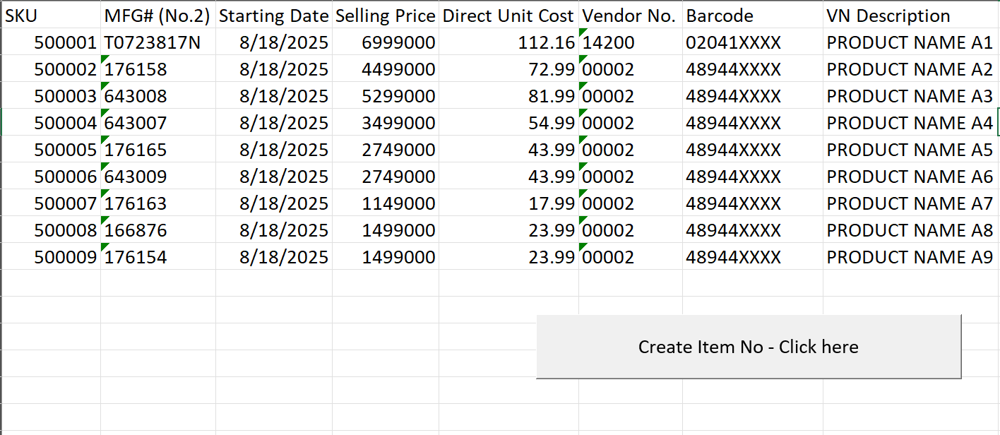

# ⚙️ Automating Data Input Workflow to Improve Accuracy & Efficiency  
**Tools:** Microsoft Excel | VBA (Macro) | Process Automation | Data Quality Control  

---

## 📘 Giới thiệu
Trong quá trình tạo mã sản phẩm mới, nhóm cần điền nhiều thông tin vào các file mẫu (template) để gửi yêu cầu cho bộ phận IT.  
Tuy nhiên, việc này thường mất nhiều thời gian và dễ xảy ra sai sót do thông tin rời rạc, không được kiểm soát tập trung.  

Dự án này được thực hiện nhằm **tự động hóa toàn bộ quy trình nhập liệu**, giúp đảm bảo **tính chính xác, đầy đủ và giảm thiểu thời gian thao tác thủ công** cho người dùng.

---

## 🎯 Mục tiêu dự án
- Tập trung và kiểm soát tất cả thông tin cần điền trong một file Excel duy nhất.  
- Tự động điền dữ liệu vào các file template nhờ macro VBA.  
- Tăng tốc độ xử lý và giảm thiểu lỗi khi gửi yêu cầu tạo mã sản phẩm.  
- Tạo quy trình có thể tái sử dụng, dễ chuyển giao cho các thành viên khác trong nhóm.

---

## 🧩 Giải pháp thực hiện
1. **Xây dựng file Excel trung tâm:**  
   - Gồm nhiều sheet tương ứng với từng loại yêu cầu hoặc trường hợp tạo mã.  
   - Các ô dữ liệu được định danh và cấu trúc rõ ràng để dễ dàng kiểm soát.
   - Một vài ô được dùng để lưu đường dẫn đến các file template và thư mục xuất kết quả, nhằm đảm bảo khả năng linh hoạt giữa các máy tính.

2. **Tự động hóa bằng VBA:**  
   - Viết macro để tự động mở file template, điền dữ liệu vào đúng vị trí, lưu lại và đóng file.  
   - Tạo folder mới tự động theo ngày giờ thực thi để lưu các file đã hoàn tất.  
   - Sử dụng cơ chế kiểm soát lỗi (`On Error GoTo`) để đảm bảo tính ổn định khi chạy macro.  
   - Hiển thị thông báo hoàn tất quy trình cho người dùng sau khi xử lý xong.

3. **Phân phối và hướng dẫn sử dụng:**  
   - Chia sẻ file macro cho các thành viên trong nhóm.  
   - Hướng dẫn cài đặt và kích hoạt macro trên máy cá nhân.  
   - Chạy thử nghiệm (test run) để đảm bảo tính tương thích và ổn định.

---

## 📊 Kết quả đạt được
- **Giảm thời gian nhập liệu** từ hơn **20 phút xuống dưới 2 phút** cho mỗi yêu cầu.  
- **Đảm bảo 100% tính chính xác và đầy đủ** của thông tin được điền.  
- **Tăng năng suất công việc**, giảm sai sót và đơn giản hóa quy trình kiểm tra thông tin.  
- **Cải thiện khả năng phối hợp nhóm** nhờ quy trình chuẩn hóa, có thể áp dụng cho nhiều thành viên khác nhau.

---

## 🛠️ Công cụ & Kỹ thuật sử dụng
- **Microsoft Excel** (với Macro & VBA)  
- **File System Automation** (tạo và lưu file tự động)  
- **Error Handling & Message Notification**  
- **Data Validation & Standardization**

---

## 📸 Kết quả
### Folder

  

### Template

  

---

## ✉️ Tác giả
**Tram Dang Tai**
📧 [Liên hệ qua LinkedIn](https://www.linkedin.com/in/tramdangtai)
